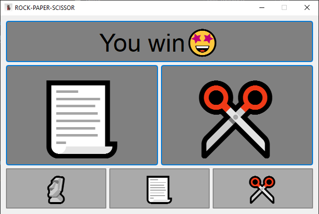

# Rock-Paper-Scissors Game (PyQt5)

A simple GUI implementation of the classic **Rock-Paper-Scissors** game using Python and PyQt5.  
The game starts when the player clicks any button. Each button then becomes a choice (Rock, Paper, or Scissors), and once a choice is made, all buttons are disabled to prevent multiple selections.

---

## 🎮 Features

- ✅ Start game on any button press
- ✅ Rock, Paper, Scissors selection
- ✅ Buttons auto-disable after selection
- ✅ Computer randomly picks its move
- ✅ Result (Win / Lose / Draw) shown with your choice
- ✅ Styled buttons and disabled state

---

## 🛠️ Requirements

- Python 3.x
- PyQt5

Install with pip if not yet installed:

```bash
pip install pyqt5
```
## 🚀 How to Run

Clone or download this project, then run:
```bash
python rock_paper_scissors.py
```
## 📸 Preview

## 🔍 Code Highlights

- Button press handled using lambda:
```bash
self.rock.clicked.connect(lambda: self.play("Rock"))
```
- Button disable after play:
```bash
self.rock.setEnabled(False)
self.paper.setEnabled(False)
self.scissors.setEnabled(False)
```
- Random choice by computer:
```bash
comp_choice = random.choice(["🗿", "📃", "✂️"])
```
## 👤 Author

Made by Fadil Nurmaulid
As a fun mini project to explore PyQt5 and GUI interactivity.


